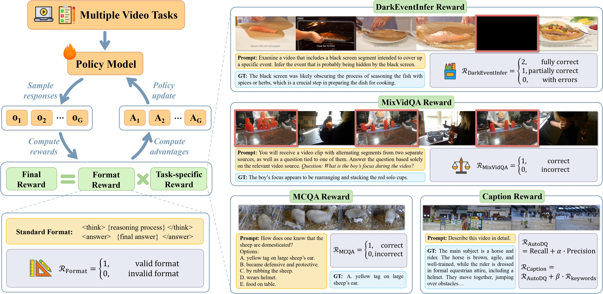

# VersaVid-R1: A Versatile Video Understanding and Reasoning Model from Question Answering to Captioning Tasks

[[🤗 Model](https://huggingface.co/VersaVid-R1/VersaVid-R1)] [[🤗 Training Data](https://huggingface.co/datasets/VersaVid-R1/VersaVid-R1_training_data)]

## 👀 Overview
Recent advancements in MLLMs have successfully extended the *Reason-Then-Respond* paradigm to image-based reasoning, yet video-based reasoning remains an underdeveloped frontier, primarily due to the scarcity of high-quality reasoning-oriented data and effective training methodologies. 

To bridge this gap, we introduce **DarkEventInfer** and **MixVidQA**, two novel datasets specifically designed to stimulate the model's advanced video understanding and reasoning abilities. 

- DarkEventinfer presents videos with masked event segments, requiring models to infer the obscured content based on contextual video cues.
- MixVidQA presents interleaved video sequences composed of two distinct clips, challenging models to isolate and reason about one while disregarding the other. 



Leveraging these carefully curated training samples together with reinforcement learning guided by diverse reward functions, we develop **VersaVid-R1**, the first versatile video understanding and reasoning model under the *Reason-Then-Respond* paradigm capable of handling general video understanding, video complex reasoning, and video captioning tasks.


## 🔧 Set up
To get started, follow the steps below:
```bash
git clone https://github.com/VersaVid-R1/VersaVid-R1.git
cd VersaVid-R1
conda create -n VersaVid-R1 python=3.10
conda activate VersaVid-R1
pip3 install -e ".[dev]"
pip3 install flash_attn --no-build-isolation
cd qwen-vl-utils
pip install -e .
cd ..
```
Note: After downloading the training data, please update the root directory path in ``VersaVid-R1_training_data.jsonl`` and ``run_qwen25vl_train.sh``.

## 🚀 Training
> **Hardware Note:** Our training was conducted on a system with 8 × A800 (80GB) GPUs. For different hardware configurations, please adjust the corresponding settings accordingly—such as the deployment of judge models in ``src/qwen25_judge_service.py`` and GPU device configurations in ``run_qwen25vl_train.sh``.

### Step 1: Deploy Judge Models
Before starting training, deploy the judge models used for evaluation across DarkEventInfer, MixVidQA, and captioning tasks:
```python
python src/qwen25_judge_service.py
python src/gpt35_judge_service.py
```

### Step 2: Run Training Script
Once the judge models are ready, you can begin training by executing the provided shell script:

```bash
bash run_qwen25vl_train.sh
```

## 🙏 Acknowledgements
We sincerely appreciate the contributions of the open-source community. Our project builds upon [Open-R1-Video](https://github.com/Wang-Xiaodong1899/Open-R1-Video), [open-r1](https://github.com/huggingface/open-r1) and etc.

## 📚 Citation
If you find our work helpful for your research, please consider citing our work.   

```
TODO
```